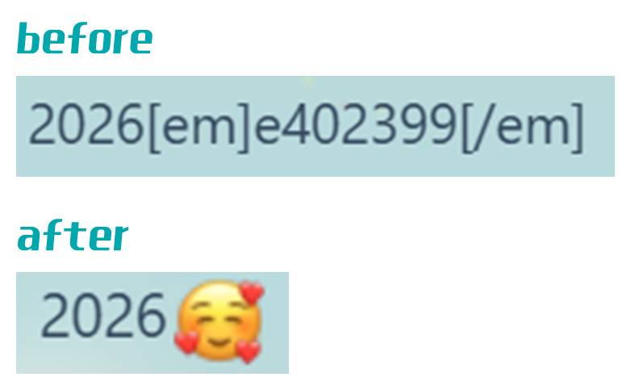

# QQEmotionParser - 轻量级 QQ 空间动态表情解析库

一个轻量级的JavaScript库，用于解析QQ动态导出的 `[em]e数字[/em]` 格式表情代码，并将其转换为可显示的图片表情。



## ✨ 特性

- 🔧 **简单易用**：一行代码解析表情
- 🚀 **轻量高效**：无外部依赖，压缩后仅2KB
- 🔧 **高度可配置**：支持自定义样式和URL
- 🛡️ **安全可靠**：支持XSS防护和错误处理
- 📱 **多环境支持**：浏览器、Node.js、Vue、React等

## 📦 安装

### 通过CDN使用（推荐）

```html
<!-- 使用具体版本（稳定） -->
<script src="https://cdn.jsdelivr.net/gh/lsqkk/qq-emotion-parser@v1.0.0/qq-emotion-parser.min.js"></script>

<!-- 或使用最新版本 -->
<script src="https://cdn.jsdelivr.net/gh/lsqkk/qq-emotion-parser/qq-emotion-parser.min.js"></script>
```

### 通过NPM安装

```bash
npm install qq-emotion-parser
```

```javascript
// ES6模块
import QQEmotionParser from 'qq-emotion-parser';

// CommonJS
const QQEmotionParser = require('qq-emotion-parser');
```

## 🚀 快速开始

### 基本使用

```javascript
// 创建解析器实例
const parser = new QQEmotionParser();

// 解析文本中的表情
const text = "今天很开心[em]e402399[/em]";
const result = parser.parse(text);
// 输出: 今天很开心

// 直接渲染DOM元素
<div id="content">表情[em]e402399[/em]测试</div>
<script>
  parser.parseElement('#content');
</script>
```

### 在Vue中使用

```vue
<template>
  <div v-html="parsedContent"></div>
</template>

<script>
import QQEmotionParser from 'qq-emotion-parser';

export default {
  data() {
    return {
      content: "动态内容[em]e100[/em]",
      parser: new QQEmotionParser()
    };
  },
  computed: {
    parsedContent() {
      return this.parser.parse(this.content);
    }
  }
};
</script>
```

### 在React中使用

```jsx
import React, { useMemo } from 'react';
import QQEmotionParser from 'qq-emotion-parser';

function DynamicContent({ content }) {
  const parser = useMemo(() => new QQEmotionParser(), []);
  const parsedContent = useMemo(() => parser.parse(content), [content]);
  
  return <div dangerouslySetInnerHTML={{ __html: parsedContent }} />;
}
```

## ⚙️ 配置选项

创建解析器时可传入配置对象：

```javascript
const parser = new QQEmotionParser({
  // 表情图片基础URL
  baseUrl: 'https://qzonestyle.gtimg.cn/qzone/em/',
  
  // 表情图片CSS类名
  className: 'qq-emotion',
  
  // 图片大小（像素）
  size: 24,
  
  // alt文本格式
  altFormat: '[表情{id}]',
  
  // 是否启用悬停提示
  enableTooltip: true,
  
  // 图片加载错误回调
  onError: (img, emotionId) => {
    console.warn(`表情加载失败: ${emotionId}`);
    img.outerHTML = `[表情${emotionId}]`;
  }
});
```

## 📖 API 参考

### 方法列表

| 方法 | 参数 | 返回值 | 说明 |
|------|------|--------|------|
| **parse(text, options)** | `text`: 要解析的文本<br>`options`: 配置对象（可选） | `string` | 解析文本中的表情代码 |
| **parseElement(selector, options)** | `selector`: CSS选择器或DOM元素<br>`options`: 配置对象（可选） | `void` | 直接解析DOM元素内容 |
| **parseBatch(texts, options)** | `texts`: 文本数组<br>`options`: 配置对象（可选） | `string[]` | 批量解析多个文本 |
| **safeParse(text)** | `text`: 要解析的文本 | `string` | 安全解析（防止XSS） |
| **extractEmotionIds(text)** | `text`: 包含表情代码的文本 | `string[]` | 提取表情ID数组 |
| **setConfig(newConfig)** | `newConfig`: 新配置对象 | `void` | 更新配置 |
| **resetConfig()** | 无 | `void` | 重置为默认配置 |

### 使用示例

```javascript
// 1. 批量处理
const texts = ["文本1[em]e100[/em]", "文本2[em]e101[/em]"];
const results = parser.parseBatch(texts);

// 2. 安全解析（防止用户输入恶意代码）
const userInput = '<script>alert("xss")</script>[em]e100[/em]';
const safe = parser.safeParse(userInput);

// 3. 提取表情ID
const ids = parser.extractEmotionIds("你好[em]e100[/em]再见[em]e101[/em]");
// 返回: ["100", "101"]

// 4. 动态更新配置
parser.setConfig({ size: 32, className: 'large-emotion' });
```

## 🎨 样式定制

通过CSS自定义表情样式：

```css
/* 基础样式 */
.qq-emotion {
  vertical-align: middle;
  transition: transform 0.2s ease;
}

/* 悬停效果 */
.qq-emotion:hover {
  transform: scale(1.2);
}

/* 不同尺寸 */
.qq-emotion.small {
  width: 20px !important;
  height: 20px !important;
}

.qq-emotion.large {
  width: 32px !important;
  height: 32px !important;
}
```

## 🔧 高级用法

### 预加载表情

```javascript
// 预加载常用表情，提升用户体验
async function preloadEmotions(ids) {
  const promises = ids.map(id => {
    return new Promise((resolve) => {
      const img = new Image();
      img.src = `https://qzonestyle.gtimg.cn/qzone/em/e${id}.gif`;
      img.onload = resolve;
      img.onerror = resolve;
    });
  });
  await Promise.all(promises);
}

// 使用
preloadEmotions(['100', '101', '102', '400408', '400829']);
```

### 自定义图片源

```javascript
// 使用本地或自定义表情包
const customParser = new QQEmotionParser({
  baseUrl: '/assets/qq-emotions/',
  // 或者使用其他CDN
  // baseUrl: 'https://your-cdn.com/emotions/'
});
```

## ❓ 常见问题

### Q1: 为什么有些表情显示不出来？
A: 可能是表情ID不存在或图片链接失效。QQ表情ID范围很广，建议：
1. 检查控制台是否有404错误
2. 使用 `onError` 回调处理失败情况
3. 确认你的QQ动态中实际使用的表情ID

### Q2: 如何获取更多的表情ID映射？
A: QQ官方未公开完整映射表，但你可以：
1. 从QQ动态导出更多内容收集ID
2. 通过浏览器开发者工具查看QQ空间实际请求
3. 使用网络爬虫批量收集（注意合法性）

### Q3: 支持Node.js环境吗？
A: 支持，但需要DOM环境模拟。在纯Node.js中使用时：
```javascript
const { JSDOM } = require('jsdom');
const dom = new JSDOM();
global.document = dom.window.document;
```

### Q4: 如何贡献代码？
A: 欢迎提交Issue和Pull Request：
1. Fork本仓库
2. 创建功能分支
3. 提交更改
4. 推送到分支
5. 创建Pull Request

## 📄 许可证

MIT License - 详见 [LICENSE](LICENSE) 文件

## 📞 支持与反馈

- 提交Issue: [GitHub Issues](https://github.com/lsqkk/qq-emotion-parser/issues)
- 邮箱: jsxzznz@163.com
- 博客: [夸克博客](https://lsqkk.github.io)

## 🚀 更新日志

### v1.0.0
- 首次发布
- 支持基本表情解析功能
- 提供多种使用方式
- 完善的API文档

---
⭐ 如果这个项目对你有帮助，请给个Star支持一下！